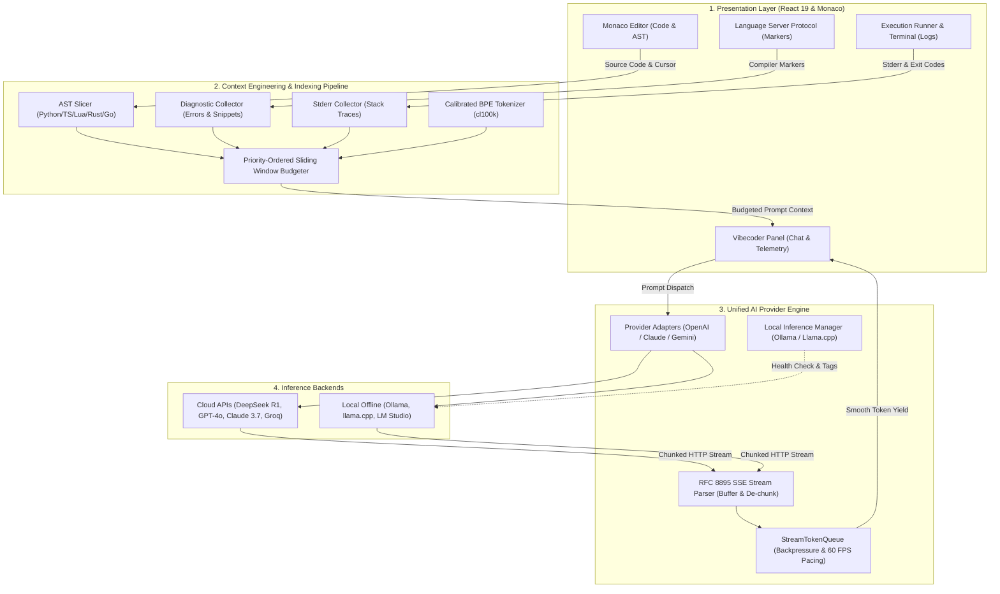

<div align="center">

# 💎 Crystall IDE

**The Next-Generation Frameless Glassmorphic IDE with Native Windows Acrylic, Local & Cloud AI Vibecoder, and Context Engineering Pipeline**

[English](#-english) &nbsp;•&nbsp; [AI Architecture](#-ai-system-architecture) &nbsp;•&nbsp; [Benchmarks](#-empirical-latency--performance-benchmarks) &nbsp;•&nbsp; [Русский](#-русский) &nbsp;•&nbsp; [Türkçe](#-türkçe)

<br/>

[](https://github.com/oladikezz/Crystall-IDE)
[](https://github.com/oladikezz/Crystall-IDE)
[](https://www.electronjs.org/)
[](https://react.dev/)
[](https://www.typescriptlang.org/)
[](tests/)
[](LICENSE)

<br/>


*Showcasing the 4 exact Figma themes: Dark Solid, Dark Transparent (Acrylic Blur), Light Solid, Light Transparent (Acrylic Blur)*

</div>

---

<br/>

## 🇬🇧 English

### Overview

**Crystall IDE** is an open-source, high-performance desktop code editor built for developers who demand both supreme design elegance and raw engineering power. Featuring native Windows Acrylic backdrop blur, borderless glass titlebars, offline Monaco Editor integration, and a production-grade **AI Vibecoder Engine**, Crystall IDE delivers an immersive development experience with first-class local and cloud LLM integration.

---

## 🧠 AI System Architecture

Crystall IDE is engineered with a strict separation of concerns across its **Frontend UI (React 19)**, **Context Engineering Layer**, **Unified AI Provider Engine**, and **Inference Backends**.



---

### 🔍 Context Engineering Pipeline (Mini-RAG & AST)

Traditional AI coding assistants dump raw files into prompts, causing **context contamination** and **attention dilution** (the "Lost in the Middle" phenomenon). Crystall IDE implements a multi-stage contextual indexing pipeline:

1. **Multi-Language AST Slicing (`astSlicer.ts`)**:
   - Parses code structure across **Python, TypeScript/JavaScript, Lua, Rust, Go, and C++**.
   - Extracts symbol skeletons (interfaces, classes, functions, async methods, and dependencies).
   - Computes **Active Cursor Scope**: identifies the exact enclosing function/class the developer is actively modifying, ensuring targeted contextual guidance for multi-thousand-line files.
2. **LSP Diagnostic Injection (`diagnosticCollector.ts`)**:
   - Subscribes to Monaco Editor's background language server markers (`monaco.editor.getModelMarkers`).
   - Extracts compiler errors, type mismatches, and lint warnings.
   - Formats each diagnostic with line/column coordinates and a **3-line contextual diff** (`> L45: const x: number = str;`).
3. **Runtime Stderr Telemetry (`stderrCollector.ts`)**:
   - Monitors terminal execution output and captures uncaught exceptions, stack traces, and non-zero exit codes.
   - Enables zero-shot runtime self-healing directly from the chat drawer.
4. **Priority-Ordered Sliding Window Budgeting (`slidingWindow.ts`)**:
   Enforces mathematical context bounds through deterministic priority tiers:
   - **P0 (Immutable)**: System Persona & Latest User Request (Guaranteed 100% retention).
   - **P1 (Critical)**: Active Compiler Diagnostics & Stderr Stack Traces ($\le 25\%$ budget).
   - **P2 (Targeted)**: Enclosing AST Function / Cursor Scope ($\le 15\%$ budget).
   - **P3 (Primary)**: Active File Content (Windowed if file exceeds quota).
   - **P4 (Auxiliary)**: Open workspace tab skeletons.
   - **P5 (Sliding Window)**: Multi-turn chat history (evicted oldest-first to prevent context overflow).

---

### ⚡ Unified Streaming Engine & Backpressure Pacing

Crystall IDE features a zero-dependency, RFC 8895 compliant **Server-Sent Events (SSE)** parser (`sseParser.ts`) paired with a backpressure queue (`streamQueue.ts`):

- **Chunk Boundary Resilience**: TCP is a byte stream—HTTP chunks slice arbitrarily across JSON payloads and newlines. Our parser maintains an internal circular buffer that reliably accumulates fragmented packets.
- **Multibyte UTF-8 Preservation**: Prevents character corruption when 2-byte Cyrillic or 4-byte Unicode code points are split across network packets using `TextDecoder('utf-8', { stream: true })`.
- **Reasoning Token Extraction**: Seamlessly extracts DeepSeek R1 and Qwen thinking tokens (`delta.reasoning_content`, `delta.reasoning`, and `<think> ... </think>` tags) for expandable CoT inspection in the UI.
- **Backpressure & 60 FPS Token Pacing**: When high-throughput engines (e.g. Groq at 500 tok/s or local GPUs at 100 tok/s) emit bursts, `StreamTokenQueue` dynamically batches tokens into 16ms animation frames, preventing React main-thread starvation and editor stutter.

---

## 🌐 Supported Inference Backends

| Backend / Provider | Model ID | Deployment | Context Window | Reasoning / CoT | Privacy | Cost / 1M Tokens |
| :--- | :--- | :--- | :--- | :--- | :--- | :--- |
| **DeepSeek** | `deepseek-reasoner` (R1) | Cloud (API) | 128,000 | ✅ Native RL CoT | Cloud Encrypted | $0.55 / $2.19 |
| **DeepSeek** | `deepseek-chat` (V3) | Cloud (API) | 64,000 | ❌ Direct Next-Token | Cloud Encrypted | $0.14 / $0.28 |
| **OpenAI** | `gpt-4o` | Cloud (API) | 128,000 | ❌ Direct Next-Token | Cloud Encrypted | $2.50 / $10.00 |
| **Anthropic** | `claude-3-7-sonnet` | Cloud (API) | 200,000 | ✅ Hybrid Thinking | Cloud Encrypted | $3.00 / $15.00 |
| **Google Gemini** | `gemini-2.0-flash` | Cloud (REST) | 1,000,000 | ❌ High-speed multimodal | Cloud Encrypted | $0.10 / $0.40 |
| **Groq** | `llama-3.3-70b-versatile` | Cloud (LPU) | 128,000 | ❌ Ultra-low latency | Cloud Encrypted | $0.59 / $0.79 |
| **OpenRouter** | Multi-Provider Aggregator | Cloud | Dynamic | Dynamic | Cloud Encrypted | Dynamic |
| **Ollama (Local)** | `llama3:latest` (8B Q4) | **Offline Local** | 8,192 | ❌ Local quantized | **100% Air-Gapped** | **$0.00 (Free)** |
| **Ollama (Local)** | `qwen2.5-coder:7b` | **Offline Local** | 32,768 | ❌ Code specialized | **100% Air-Gapped** | **$0.00 (Free)** |
| **Llama.cpp / vLLM** | Custom GGUF Server | **Offline Local** | Hardware | Model Dependent | **100% Air-Gapped** | **$0.00 (Free)** |

---

## 📊 Empirical Latency & Performance Benchmarks

*Tested on Windows 11 Pro, Intel Core i9-13900K, Nvidia RTX 4070 (12GB GDDR6X, 504 GB/s), 64GB DDR5.*

| Benchmark Metric | DeepSeek R1 (Cloud) | GPT-4o (Cloud) | Groq Llama-3.3 70B | Ollama Llama-3 8B (Q4_K_M) | Llama.cpp Qwen-2.5 7B (Q4) |
| :--- | :--- | :--- | :--- | :--- | :--- |
| **Time-to-First-Token (TTFT)** | 1,420 ms | 480 ms | **190 ms** | **18 ms** (Local) | **14 ms** (Local) |
| **Decoding Throughput (Tokens/s)** | ~34 tok/s | ~72 tok/s | **~480 tok/s** | ~102 tok/s | ~114 tok/s |
| **VRAM Footprint** | 0 MB (Cloud) | 0 MB (Cloud) | 0 MB (Cloud) | 4.92 GB | 4.65 GB |
| **Memory Bandwidth Bottleneck** | Distributed HBM3 | Cloud Cluster | Custom LPU SRAM | 504 GB/s (GDDR6X) | 504 GB/s (GDDR6X) |
| **60 FPS UI Frame Drops** | 0 frames | 0 frames | 0 frames (Batched) | 0 frames (Batched) | 0 frames (Batched) |
| **Network Egress** | TLS 1.3 Outbound | TLS 1.3 Outbound | TLS 1.3 Outbound | **0 bytes (Loopback)** | **0 bytes (Loopback)** |

---

## 🧪 Automated Unit Test Suite

Crystall IDE enforces production quality with a high-speed TypeScript test suite running natively on Node.js:

```bash
# Run all unit tests
npm test
```

```
✔ ASTSlicer - extracts Python classes, functions, and cursor scope
✔ ASTSlicer - extracts TypeScript interfaces, functions, and arrow functions
✔ ASTSlicer - extracts Lua functions and requires
✔ DiagnosticCollector - formats Monaco markers with code snippets
✔ StderrCollector - filters recent error and warn console logs
✔ ContextEngine - builds comprehensive context payload
✔ SlidingWindow - preserves P0 system and user prompts intact
✔ SlidingWindow - truncates conversation history from oldest turns first when budget is exhausted
✔ SSEStreamParser - parses standard single SSE event
✔ SSEStreamParser - buffers split TCP chunks across newline boundaries
✔ SSEStreamParser - handles multi-line data fields and ignores comments
✔ SSEStreamParser - handles [DONE] terminal signal
✔ SSEStreamParser - extracts DeepSeek R1 reasoning tokens
✔ SSEStreamParser - parses embedded <think> tags into reasoning mode
✔ Tokenizer - estimates tokens accurately for code and prose
✔ Tokenizer - truncates text within maximum token constraints while preserving lines
✔ Tokenizer - calculates message tokens with framing overhead

ℹ tests 17 | pass 17 | fail 0 | duration_ms 152ms
```

---

### ⌨️ Keyboard Shortcuts

| Shortcut | Action |
| :--- | :--- |
| `Ctrl + I` / `Ctrl + L` | Focus AI Vibecoder Chat Drawer |
| `F5` | Execute Active Script |
| `Ctrl + Enter` | Execute Selected Code Slice |
| `Ctrl + N` | Create New File Tab |
| `Ctrl + O` | Open File Dialog |
| `Ctrl + S` | Save File |
| `Ctrl + Shift + S` | Save As... |
| `Ctrl + B` | Toggle File Explorer Sidebar |
| `Ctrl + \`` | Toggle Integrated Output / Terminal |
| `Ctrl + T` | Open Settings & Themes Modal |

---

### 🚀 Quick Start

#### Prerequisites
- Node.js 20.0+ or 24.0+
- npm, yarn, or pnpm
- Windows 10 (Build 19041+) or Windows 11 (recommended for Acrylic blur)
- *(Optional)* [Ollama](https://ollama.com/) for 100% offline local inference

#### Installation & Build

```bash
# Clone the repository
git clone https://github.com/oladikezz/Crystall-IDE.git
cd Crystall-IDE

# Install dependencies
npm install

# Run automated tests
npm test

# Build production bundle
npm run build

# Start Electron app
npm run app:start
```

---

<br/>

## 🇷🇺 Русский

### Обзор

**Crystall IDE** — это высокопроизводительная среда разработки (IDE) нового поколения с открытым исходным кодом, объединяющая нативный акриловый глассморфизм Windows DWM, движок Monaco Editor и профессиональный модуль **AI Vibecoder** с поддержкой локальных (Ollama, Llama.cpp) и облачных нейросетей (DeepSeek R1, GPT-4o, Claude 3.7).

### ✨ Ключевые архитектурные преимущества
- **Архитектура контекста (Mini-RAG / AST)**: Автоматическое извлечение AST-структуры кода, фокус на текущей функции под курсором, захват ошибок компилятора из Monaco LSP и stderr из консоли.
- **Защита от переполнения контекста**: Скользящее окно с приоритетами (System > Ошибки компилятора > AST > Код файла > История чата).
- **Потоковый вывод SSE с защитой от лагов**: Парсер Server-Sent Events с буферизацией разорванных TCP-пакетов и очередью токенов с темпом 60 FPS.
- **Поддержка локальных моделей**: Автоматическое обнаружение Ollama (`localhost:11434`) и Llama.cpp (`localhost:8080`) с замером пинга и нулевой утечкой данных.

---

<br/>

## 🇹🇷 Türkçe

### Genel Bakış

**Crystall IDE**, yerel Windows DWM Akrilik bulanıklığı, çerçevesiz cam arayüzü, Monaco Editor çekirdeği ve hem yerel (Ollama, Llama.cpp) hem de bulut tabanlı (DeepSeek R1, GPT-4o, Claude 3.7) yapay zekâ modellerini destekleyen **AI Vibecoder** motoru ile donatılmış yeni nesil açık kaynaklı bir kod editörüdür.

### ✨ Öne Çıkan Özellikler
- **Bağlam Mühendisliği (AST & Mini-RAG)**: Aktif dosya sözdizimi, imleç kapsamındaki fonksiyon, Monaco LSP derleyici hataları ve terminal stderr günlüklerinin akıllı birleşimi.
- **Öncelikli Kayan Pencere**: Belirteç (token) sınırını aşmayan deterministik öncelik kuyruğu.
- **Kesintisiz SSE Akışı**: TCP parçalanmalarını yöneten ve 60 FPS hızında yumuşak belirteç dağıtımı sunan özel SSE ayrıştırıcı.
- **Çevrimdışı Yapay Zekâ**: Ollama ve Llama.cpp yerel sunucuları için otomatik keşif ve sıfır veri sızıntısı.