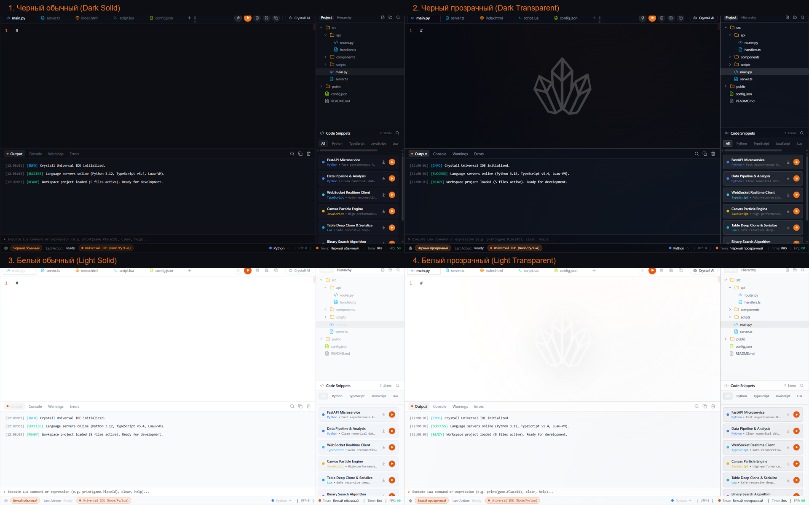
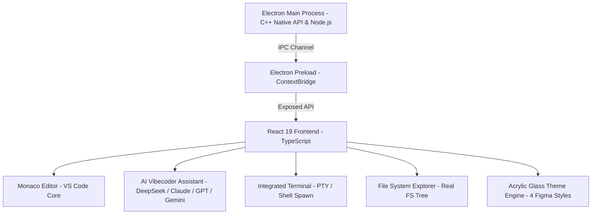

<div align="center">

# 💎 Crystall IDE

**The Next-Generation Frameless Glassmorphic IDE with Native Windows Acrylic & AI Vibecoder**

[English](#-english) &nbsp;•&nbsp; [Русский](#-русский) &nbsp;•&nbsp; [Türkçe](#-türkçe)

<br/>

[](https://github.com/oladikezz/Crystall-IDE)
[](https://github.com/oladikezz/Crystall-IDE)
[](https://www.electronjs.org/)
[](https://react.dev/)
[](https://www.typescriptlang.org/)
[](LICENSE)

<br/>



*Showcasing the 4 exact Figma themes: Dark Solid, Dark Transparent (Acrylic Blur), Light Solid, Light Transparent (Acrylic Blur)*

</div>

---

<br/>

## 🇬🇧 English

### Overview

**Crystall IDE** is an ultra-modern, aesthetic, and high-performance desktop code editor built for developers who demand both supreme design elegance and raw engineering power. Featuring native Windows Acrylic backdrop blur, a borderless custom glass titlebar, Monaco Editor integration (powering VS Code), and a built-in AI Vibecoder, Crystall IDE provides an immersive, distraction-free environment for multi-language programming.

### ✨ Key Features

- **🪟 True Windows Acrylic & Glassmorphism**:
  Engineered with genuine Windows DWM Acrylic materials (`setBackgroundMaterial('acrylic')`), transparent window composition (`transparent: true`), and custom frosted glass shaders. Monaco minimaps, gutters, and panels blend seamlessly into your desktop background.
- **🎨 4 Exact Figma Themes**:
  1. `Dark Solid` — Sleek, deep obsidian aesthetic for minimal distraction and maximum contrast.
  2. `Dark Transparent` — Translucent dark glass with real-time system backdrop blur.
  3. `Light Solid` — Crisp, immaculate daylight theme for bright office and sunlight conditions.
  4. `Light Transparent` — Frosted pearl glass with luminous desktop transparency.
- **🤖 Built-in AI Vibecoder**:
  - Context-aware code generation, deep refactoring, and inline error explanations.
  - Multi-model support: DeepSeek R1 (reasoning), Claude 3.5 Sonnet, GPT-4o, and Gemini 2.0 Flash.
  - Interactive chat, streaming output, and one-click code insertion into the active editor.
- **⚡ Pro Multi-Language Studio**:
  - Full Monaco Editor engine with rich syntax highlighting, IntelliSense, autocompletion, bracket pair colorization, and code folding.
  - First-class support for Python, TypeScript, JavaScript, Lua, C++, Rust, Go, HTML, CSS, JSON, Markdown, and more.
- **📁 Real Filesystem Explorer**:
  - High-performance tree view powered by native Node.js / Electron IPC (`fs-extra`).
  - Open folder, create, rename, and delete files/directories, quick file search, and dirty file indicators (`•`).
- **💻 Integrated Terminal**:
  - Built-in multi-instance shell (PowerShell / Command Prompt / Bash) with real-time streaming I/O, ANSI colors, process management, and clear screen.
- **🎯 Frameless Window Controls**:
  - Draggable non-client titlebar with native Windows minimize, maximize/restore, and close behaviors.

---

### ⌨️ Keyboard Shortcuts

| Shortcut | Action |
| :--- | :--- |
| `Ctrl + N` | Create New File |
| `Ctrl + O` | Open File / Folder |
| `Ctrl + S` | Save Current File |
| `Ctrl + Shift + S` | Save All Modified Files |
| `Ctrl + W` | Close Active Tab |
| `Ctrl + \`` | Toggle Integrated Terminal |
| `Ctrl + B` | Toggle File Explorer Sidebar |
| `Ctrl + L` | Focus AI Vibecoder Chat |
| `Ctrl + T` | Open Theme Selector (4 Figma Themes) |
| `Ctrl + F` | Search within File |
| `Ctrl + Shift + F` | Global Project Search |

---

### 🚀 Quick Start

#### Prerequisites
- Node.js 18.0+ or 20.0+
- npm, yarn, or pnpm
- Windows 10 (Build 19041+) or Windows 11 (recommended for native Acrylic blur)

#### Installation & Development

```bash
# Clone the repository
git clone https://github.com/oladikezz/Crystall-IDE.git
cd Crystall-IDE

# Install dependencies
npm install

# Start development mode (Vite + Electron)
npm run dev

# Compile TypeScript and bundle frontend
npm run build

# Package portable Windows x64 binary
npm run dist
```

---

<br/>

## 🇷🇺 Русский

### Обзор

**Crystall IDE** — это ультрасовременная, эстетичная и высокопроизводительная среда разработки (IDE), созданная для разработчиков, которые ценят визуальное совершенство и передовые технологии. Благодаря нативному размытию Windows Acrylic, безрамочному стеклянному интерфейсу, мощному движку Monaco Editor (лежащему в основе VS Code) и встроенному ИИ-ассистенту Vibecoder, Crystall IDE предлагает безупречную среду для разработки на любых языках программирования.

### ✨ Основные возможности

- **🪟 Настоящий Windows Acrylic и глассморфизм**:
  Использование системного акрилового размытия Windows DWM (`setBackgroundMaterial('acrylic')`), полной прозрачности окна (`transparent: true`) и матовых стеклянных шейдеров. Мини-карта Monaco, номера строк и боковые панели органично растворяются на фоне вашего рабочего стола.
- **🎨 4 точные темы из Figma**:
  1. `Черный обычный` (`Dark Solid`) — глубокий обсидиановый стиль без прозрачности для максимальной концентрации и контраста.
  2. `Черный прозрачный` (`Dark Transparent`) — полупрозрачное темное стекло с живым акриловым размытием фона рабочего стола.
  3. `Белый обычный` (`Light Solid`) — строгий, чистый светлый стиль для комфортной работы при ярком освещении.
  4. `Белый прозрачный` (`Light Transparent`) — матовое жемчужное стекло с кристальной глубиной и размытием.
- **🤖 Встроенный ИИ-помощник Vibecoder**:
  - Генерация кода с учетом контекста открытого проекта, глубокий рефакторинг и детальный анализ ошибок.
  - Поддержка передовых моделей: DeepSeek R1 (логика и размышления), Claude 3.5 Sonnet, GPT-4o и Gemini 2.0 Flash.
  - Потоковый вывод (streaming), интерактивный чат и вставка сгенерированного кода в редактор в один клик.
- **⚡ Полноценная многоязычная студия**:
  - Интеграция с Monaco Editor: интеллектуальная подсветка синтаксиса, IntelliSense, автодополнение, подсветка парных скобок и сворачивание кода.
  - Поддержка Python, TypeScript, JavaScript, Lua, C++, Rust, Go, HTML, CSS, JSON, Markdown и многих других языков.
- **📁 Проводник файлов с реальной файловой системой**:
  - Высокоскоростное дерево файлов на базе Electron IPC и Node.js (`fs-extra`).
  - Открытие папок, создание, переименование и удаление файлов/папок, мгновенный поиск и индикация несохраненных изменений (`•`).
- **💻 Встроенный терминал**:
  - Поддержка PowerShell, CMD и Bash с потоковым выводом в реальном времени, цветами ANSI и управлением процессами.
- **🎯 Безрамочные элементы управления**:
  - Плавная перетаскиваемая область заголовка (`drag region`) и нативные кнопки сворачивания, максимизации и закрытия.

---

### ⌨️ Горячие клавиши

| Сочетание | Действие |
| :--- | :--- |
| `Ctrl + N` | Создать новый файл |
| `Ctrl + O` | Открыть файл или папку |
| `Ctrl + S` | Сохранить текущий файл |
| `Ctrl + Shift + S` | Сохранить все открытые файлы |
| `Ctrl + W` | Закрыть активную вкладку |
| `Ctrl + \`` | Открыть / скрыть терминал |
| `Ctrl + B` | Открыть / скрыть панель проводника |
| `Ctrl + L` | Переключиться в чат ИИ Vibecoder |
| `Ctrl + T` | Выбор темы (4 темы из Figma) |
| `Ctrl + F` | Поиск по текущему файлу |
| `Ctrl + Shift + F` | Поиск по всему проекту |

---

### 🚀 Быстрый запуск

#### Требования
- Node.js 18.0+ или 20.0+
- npm, yarn или pnpm
- Windows 10 (версия 19041+) или Windows 11 (рекомендуется для идеального акрила)

#### Установка и запуск

```bash
# Клонирование репозитория
git clone https://github.com/oladikezz/Crystall-IDE.git
cd Crystall-IDE

# Установка зависимостей
npm install

# Запуск в режиме разработки (Vite + Electron)
npm run dev

# Сборка TypeScript и фронтенда
npm run build

# Создание готового переносимого исполняемого файла (Windows x64)
npm run dist
```

---

<br/>

## 🇹🇷 Türkçe

### Genel Bakış

**Crystall IDE**, hem görsel mükemmelliğe hem de yüksek mühendislik performansına önem veren yazılımcılar için tasarlanmış, ultra modern ve estetik bir masaüstü kod düzenleyicisidir. Yerel Windows Akrilik arka plan bulanıklığı (Acrylic blur), çerçevesiz cam başlık çubuğu, VS Code'un çekirdeğini oluşturan Monaco Editor ve entegre AI Vibecoder yapay zekâ asistanı ile donatılan Crystall IDE, çok dilli yazılım geliştirme süreçleri için kusursuz bir ortam sunar.

### ✨ Öne Çıkan Özellikler

- **🪟 Gerçek Windows Akrilik & Cam Tasarım (Glassmorphism)**:
  Windows DWM Akrilik malzeme desteği (`setBackgroundMaterial('acrylic')`), şeffaf pencere kompozisyonu (`transparent: true`) ve buzlu cam efektleri. Monaco kod haritası (minimap), satır numaraları ve yan paneller masaüstü arka planınızla kusursuz bir şekilde bütünleşir.
- **🎨 Birebir 4 Figma Teması**:
  1. `Koyu Düz` (`Dark Solid`) — Dikkat dağıtmayan, yüksek kontrastlı şık obsidyen siyahı tema.
  2. `Koyu Şeffaf` (`Dark Transparent`) — Gerçek zamanlı sistem bulanıklığına sahip yarı saydam koyu cam tema.
  3. `Açık Düz` (`Light Solid`) — Aydınlık çalışma ortamları için ferah, net ve kusursuz beyaz tema.
  4. `Açık Şeffaf` (`Light Transparent`) — Kristal derinliğe ve akrilik bulanıklığa sahip sedefli buzlu cam tema.
- **🤖 Entegre Yapay Zekâ Vibecoder**:
  - Açık proje bağlamını anlayan akıllı kod üretimi, derin refaktör ve satır içi hata açıklamaları.
  - Çoklu model entegrasyonu: DeepSeek R1 (akıl yürütme), Claude 3.5 Sonnet, GPT-4o ve Gemini 2.0 Flash.
  - Anlık akış (streaming) yanıtları, sohbet arayüzü ve üretilen kodu tek tıkla editöre aktarma.
- **⚡ Kapsamlı Çok Dilli Kodlama Stüdyosu**:
  - Gelişmiş sözdizimi vurgulama, IntelliSense, otomatik tamamlama, parantez renklendirme ve kod katlama.
  - Python, TypeScript, JavaScript, Lua, C++, Rust, Go, HTML, CSS, JSON, Markdown ve onlarca dili tam kapasite destekler.
- **📁 Gerçek Dosya Sistemi Yöneticisi**:
  - Node.js ve Electron IPC (`fs-extra`) altyapısıyla çalışan ultra hızlı dosya ağacı.
  - Klasör açma, dosya ve dizin oluşturma, yeniden adlandırma, silme ve kaydedilmemiş değişiklik göstergesi (`•`).
- **💻 Entegre Terminal**:
  - Gerçek zamanlı I/O akışı, ANSI renk desteği ve süreç sonlandırma özelliklerine sahip entegre komut satırı (PowerShell / CMD / Bash).
- **🎯 Çerçevesiz Özel Pencere Kontrolleri**:
  - Sürüklenebilir başlık çubuğu, Windows simge durumuna küçültme, ekranı kaplama ve kapatma butonları.

---

### ⌨️ Klavye Kısayolları

| Kısayol | İşlev |
| :--- | :--- |
| `Ctrl + N` | Yeni Dosya Oluştur |
| `Ctrl + O` | Dosya veya Klasör Aç |
| `Ctrl + S` | Geçerli Dosyayı Kaydet |
| `Ctrl + Shift + S` | Değiştirilen Tüm Dosyaları Kaydet |
| `Ctrl + W` | Etkin Sekmeyi Kapat |
| `Ctrl + \`` | Entegre Terminali Aç / Kapat |
| `Ctrl + B` | Dosya Gezgini Panelini Aç / Kapat |
| `Ctrl + L` | AI Vibecoder Sohbetine Odaklan |
| `Ctrl + T` | Tema Seçiciyi Aç (4 Figma Teması) |
| `Ctrl + F` | Dosya İçinde Ara |
| `Ctrl + Shift + F` | Tüm Projede Ara |

---

### 🚀 Hızlı Başlangıç

#### Gereksinimler
- Node.js 18.0+ veya 20.0+
- npm, yarn ya da pnpm
- Windows 10 (Sürüm 19041+) veya Windows 11 (akrilik bulanıklık için önerilir)

#### Kurulum ve Çalıştırma

```bash
# Depoyu klonlayın
git clone https://github.com/oladikezz/Crystall-IDE.git
cd Crystall-IDE

# Bağımlılıkları yükleyin
npm install

# Geliştirici modunda başlatın (Vite + Electron)
npm run dev

# TypeScript ve frontend derlemesi yapın
npm run build

# Taşınabilir Windows x64 uygulamasını paketleyin
npm run dist
```

---

<br/>

## 🛠️ Tech Stack & Architecture



- **Runtime**: [Electron 44](https://www.electronjs.org/) with native Acrylic backdrop integration
- **Frontend**: [React 19](https://react.dev/) + [TypeScript 5.7](https://www.typescriptlang.org/)
- **Styling**: [Tailwind CSS](https://tailwindcss.com/) + Custom Glass & CSS Variable Design System
- **Code Engine**: [@monaco-editor/react](https://github.com/suren-atoyan/monaco-react) (VS Code Engine)
- **Icons**: [Lucide React](https://lucide.dev/)
- **Bundler**: [Vite 6](https://vitejs.dev/)

---

## 📄 License

This project is licensed under the **MIT License** — see the [LICENSE](LICENSE) file for details.

<div align="center">
  <sub>Crafted with precision & passion by <a href="https://github.com/oladikezz">oladikezz</a></sub>
</div>